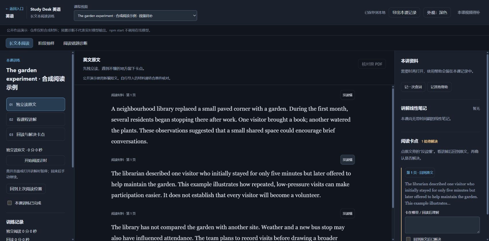
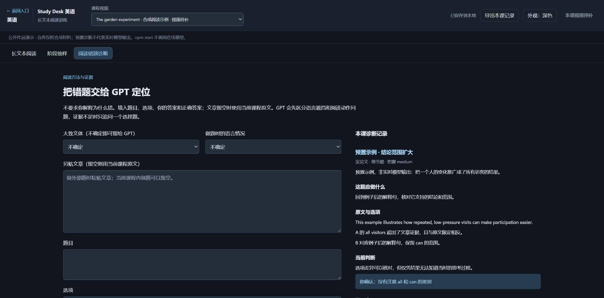

# Study Desk · 本地学习台

把阅读、课程笔记、手写练习和错题诊断放在同一个工作台，保存学习过程，并允许中断后继续。

这个项目来自我自己的备考需求。看课、记笔记、做题和回看错题原本分散在不同工具里；切换过程中，问题发生在哪里、已经看过哪些帮助、下一步要做什么，很容易丢失。我希望把这些过程连起来，同时保留每项判断的依据。

**我的工作是定义需求和产品逻辑、决定功能取舍、组织 AI 开发，并通过验收和实际使用反馈推进迭代。代码主要由 AI 辅助实现。** [个人贡献与设计决策](docs/DECISIONS.md)记录了这些工作怎样体现在产品中。



## 先体验一条完整流程

需要 Node.js 22 或更新版本。运行演示无需安装 npm 依赖，也无需模型账号。

```sh
git clone https://github.com/peterdlick-stack/study-desk.git
cd study-desk
npm start
```

打开[本地英语演示](http://127.0.0.1:4183/?subject=english)。

1. 阅读示例短文，点段落旁的“没读懂”，记下一个卡点。
2. 切到“阅读错题诊断”，查看预置示例的依据和确认选项，选择符合情况的一项。
3. 刷新页面，再回到相应面板，检查卡点与确认结果是否仍在。
4. 回到原文补充理解，标记卡点已解决。

演示材料全部为合成示例。预置诊断在页面中有明确标注，**不代表本次模型输出**；`npm start` 强制关闭在线 AI。记录保存在仓库的 `.local/`，按 `Ctrl+C` 停止服务。再次启动保留记录，不覆盖原有内容。

## 已实现的主要能力

| 使用环节 | 实现 | 可检查的证据 |
|---|---|---|
| 阅读与回读 | 段落定位、卡点记录、帮助记录、阶段切换 | [英语界面](js/english.js)、[状态逻辑](js/english-state.js) |
| AI 辅助诊断 | 检索资料片段，组织结构化输出，提出简短确认选项 | [诊断模块](lib/english-coach.mjs)、[测试](tests/english-coach.test.mjs) |
| 过程接续 | 追加事件、重建状态、识别旧页面冲突、避免重复写入 | [记录存储](lib/english.mjs)、[测试](tests/english.test.mjs) |
| 课程学习 | 笔记、时间锚点、画布、独立副屏播放器 | [课程界面](js/main.js)、[播放器](js/player.js) |
| 练习与复盘 | 手写草稿、结构化批改、错题归档、题型训练 | [练习模块](lib/practice.mjs)、[训练模块](lib/topic-training.mjs) |
| 资料与证据 | 来源绑定、文件哈希检查、帮助与独立作答分开记录 | [资料读取](lib/course-materials.mjs)、[证据计算](lib/practice-evidence.mjs) |

课程视频、个人讲义、真实题库和学习记录不随公开仓库分发。因此，视频播放、实际题目批改等流程需要自行接入有权使用的材料。公开演示优先覆盖阅读、确认和记录恢复；其余模块保留实现与合成测试。



## 几个产品判断

- **用户不必先解释自己为什么错。** 系统先利用题目、选择和资料提出可能原因，再用一个简短问题确认，保留“还不能确定”的空间。
- **完成、看过帮助和掌握是不同记录。** 阅读时间、播放进度和 AI 判断不会直接变成掌握度。缺少测量时保留 `UNKNOWN`。
- **中断后应接着处理。** 卡点、诊断和确认结果保存到本地；多个页面同时修改时报告冲突，不静默覆盖。
- **生成内容需要来源和复核。** 模型只能引用传入片段的 ID；该检查保证引用范围，不保证语义正确。内容准确性仍需独立核对。

这些决策与智能服务中的资料检索、轻量问答、过程接续有可迁移的部分。设备接口与售后知识仍需单独实现和验证。

## 运行与验证

```sh
npm test
npm run test:release
npm run check:public
```

服务使用 Node.js 内置模块，前端为原生 JavaScript / HTML / CSS，公式显示使用随仓库保存的 KaTeX。默认只监听本机回环地址。

- [运行、停止与可选 AI 接入](docs/RUNNING.md)
- [个人贡献与设计决策](docs/DECISIONS.md)
- [模块关系与数据流](docs/ARCHITECTURE.md)
- [本次验证及未验证范围](docs/VERIFICATION.md)
- [第三方组件与素材说明](THIRD_PARTY_NOTICES.md)

本仓库是从本地使用版本整理出的首次公开快照。没有重建过去的 Git 提交历史，也没有用测试通过来代替学习效果验证。
