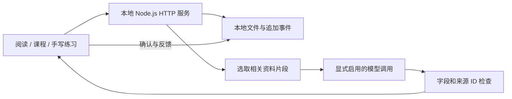

# 模块与数据流

`server.mjs` 组织本机 HTTP 接口，`js/` 提供浏览器交互，`lib/` 负责存储、检索、批改和证据计算。没有外部数据库或启动时自动安装的依赖。

英语诊断由 `lib/english-coach.mjs` 从本地文本资料选取片段，再通过 `lib/practice-grader.mjs` 的结构化调用接口调用已配置的 Codex CLI。它校验返回结构与来源 ID；语义准确性不能由这些检查保证。

`lib/english.mjs` 将用户操作追加为事件，使用前一版本和当前内容的校验值重建状态。这个机制能检测意外损坏与并发旧写入，不等于防止具备本地文件修改权限的人重算整条记录链。

练习模块保存原始提交、识别/批改报告和后续更正。证据汇总区分独立首答、帮助、重复和未知条件。视频与文档通过登记信息和哈希核对后读取。

公开版本仅监听 `127.0.0.1`。它是个人本地应用，未设计多人账号、服务器鉴权或公网部署，不应直接改为对外监听。
